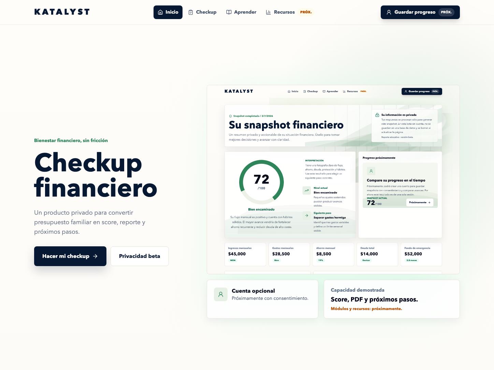
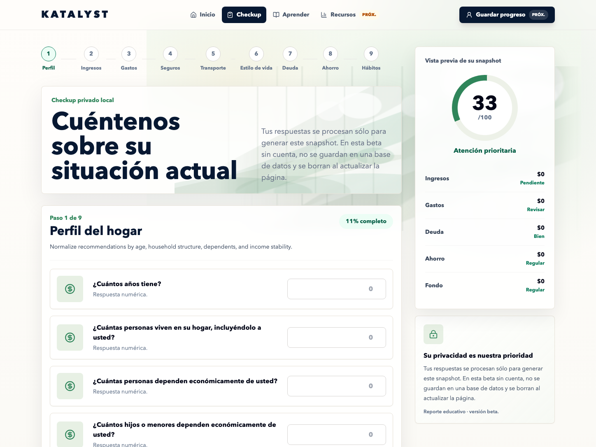
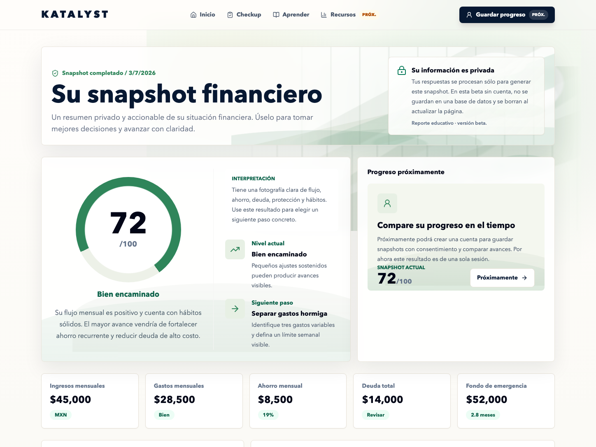
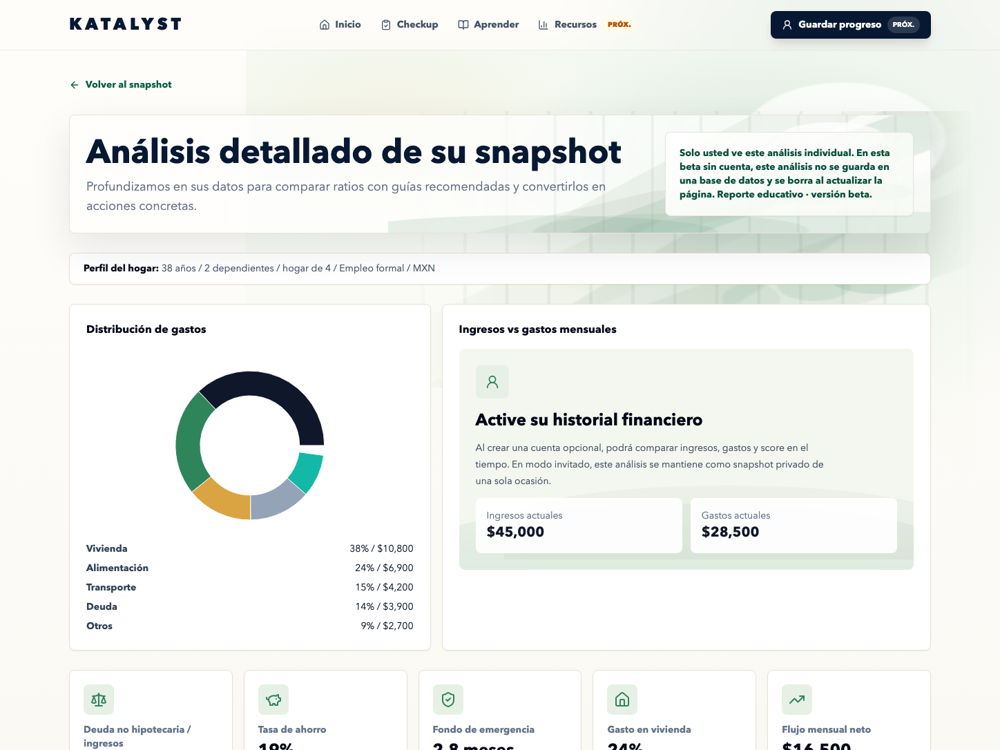
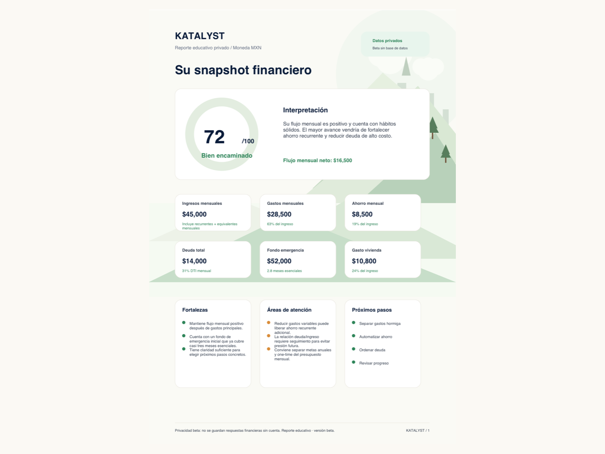
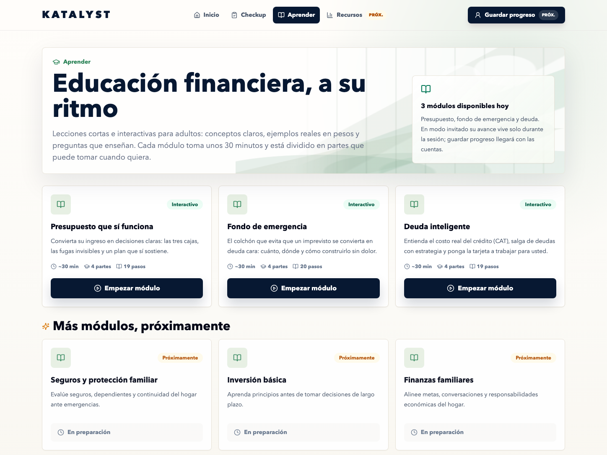
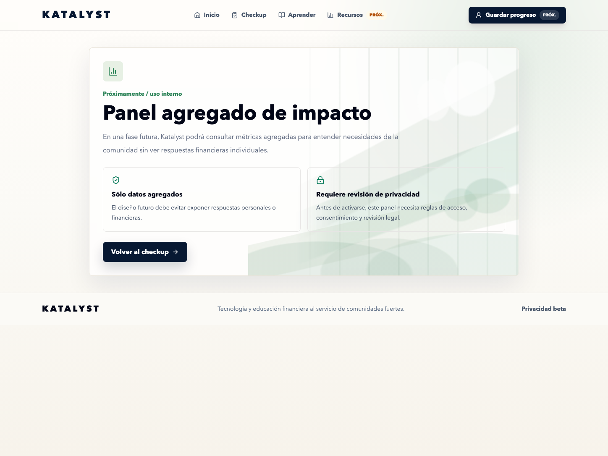

# Katalyst Checkup Financiero

Privacy-first financial education and self-assessment platform built for community impact.



## Overview

Katalyst Checkup Financiero helps users complete a private financial snapshot, understand their financial health, download a personalized PDF report, and see clear next steps. The beta also includes three starter education modules; resources, accounts, history, events, and admin insights are framed as upcoming product areas for later phases.

The Monday beta is focused on one reliable flow: checkup -> snapshot -> PDF, with starter learning modules available as supporting education. Resources, schedule, accounts, history, and admin insights are presented as upcoming product areas, not active production features.

Simple beta privacy message:

> Tus respuestas se procesan sólo para generar este snapshot. En esta beta sin cuenta, no se guardan en una base de datos y se borran al actualizar la página.
>
> Reporte educativo · versión beta.

## Why This Exists

Many people avoid financial planning tools because they feel intimidating, invasive, or judgmental. This product creates a respectful, accessible, and educational first step: a guided snapshot that turns household income, expenses, savings, debt, protection, dependents, and habits into a clear score, recommendations, and action plan.

The goal is not to replace financial advisors. It gives community members clarity, confidence, and a practical next step before they decide whether to learn more, download a report, create an account, or request support from Katalyst.

## Key Features

- Anonymous checkup with local-first data handling
- Score-first financial snapshot dashboard
- Deterministic scoring engine using income, expenses, debt, savings, dependents, protection, and financial habits
- Personalized recommendations and 30-day action plan
- Branded downloadable PDF report
- Three starter financial education modules available in beta
- Optional account/history roadmap marked as Próximamente
- Katalyst resources and schedule roadmap marked as Próximamente
- Aggregate-only admin insights roadmap marked as Próximamente
- Supabase-ready schema and privacy model

## Product Screenshots

### Landing Page


### Checkup Flow


### Financial Snapshot


### Detailed Analysis


### PDF Report


### Learning Path


### Admin Insights


## Tech Stack

- React 18
- Vite
- Tailwind CSS
- React Router
- Recharts
- Lucide React
- Framer Motion
- jsPDF for structured multi-page PDF export
- React Hook Form / Zod installed for future form hardening
- in-memory guest snapshot state for the Monday beta
- Supabase-ready schema draft for future production persistence

The current MVP is implemented in React JavaScript. The product architecture is intentionally modular so it can evolve into a TypeScript, Supabase, and Vercel production build without rewriting the scoring or UI flows.

## Privacy-First Architecture

Anonymous users can complete the checkup and download their report without creating an account. In the Monday beta, guest financial answers are held only for the current page session so the user can see the snapshot and download the PDF.

In guest mode, refreshing the page or opening a new tab does not preserve the financial snapshot. The beta does not send guest answers to a backend or save them to a database.

Future account, history, Supabase sync, analytics, and admin insights require explicit consent and legal/privacy review. Admin dashboards must only show aggregate insights. Individual financial responses should not be visible to administrators unless a future consented support flow explicitly allows it.

## Monday Beta Readiness

Ready for the July 6, 2026 Katalyst call:

- QR should open the deployed `/checkup` route
- Private one-time checkup
- Deterministic score and derived financial metrics
- Snapshot dashboard
- Detailed analysis page
- 30-day action plan
- Local PDF generation
- Simple Spanish privacy copy with legal-review asterisk

Not active in the Monday beta:

- real accounts or sign-in
- saved history
- Supabase/Auth
- active education modules
- event registration or schedule management
- admin aggregate dashboard
- analytics connected to financial answers

## Scoring Methodology

The scoring engine is deterministic and explainable. It evaluates:

- Monthly income
- Monthly expenses
- Net monthly flow
- Savings rate
- Emergency fund months
- Debt-to-income ratio
- Housing burden
- Protection and planning signals
- Financial habits
- Household structure and dependents

The output includes:

- Score from 0-100
- Financial level
- Strengths
- Areas of attention
- Recommended modules
- 30-day action plan

The v1 scoring model weights the snapshot across cash flow, expense structure, emergency fund, debt burden, protection/planning, and habits/wellbeing. It is educational and orientative, not personalized financial advice.

## Product Architecture

```txt
checkup-financiero/
├── src/
│   ├── data/
│   │   ├── checkupQuestionBank.js
│   │   └── learningModules.js
│   ├── lib/
│   │   ├── financialCalculations.js
│   │   └── pdfExport.js
│   ├── pages/
│   │   ├── CheckupPage.jsx
│   │   ├── SnapshotPage.jsx
│   │   ├── SnapshotAnalysisPage.jsx
│   │   ├── ActionPlanPage.jsx
│   │   ├── LearnPage.jsx
│   │   └── AdminPage.jsx
│   └── utils/
│       └── storage.js
├── supabase_schema_draft.sql
└── package.json
```

The most important implementation boundary is `src/lib/financialCalculations.js`: it keeps the scoring model and derived financial metrics independent from the UI. This makes the product easier to test, explain, and later connect to Supabase.

## Local Development

```bash
cd checkup-financiero
npm install
npm run dev
```

Build for production:

```bash
npm run build
```

## Future Production Path

The MVP runs as a static local-first product. A production version can add:

- Legal-reviewed privacy, retention, and financial-disclaimer language
- Supabase Auth for optional accounts
- Row-level security for saved snapshots
- User-controlled consent before saving private financial data
- Learning progress synced across devices
- Active education modules
- Real schedule/events and resource registration
- Admin aggregate analytics through secured views or RPCs
- Vercel deployment with environment-based configuration
- Final domain
- Safe analytics that do not collect sensitive financial answers

## Recruiter / Case Study Framing

This project converts a spreadsheet-based family budgeting methodology into a polished React financial wellness platform. It demonstrates product thinking, privacy-first architecture, deterministic scoring, financial data modeling, PDF generation, dashboard design, educational UX, and stakeholder-facing execution for a nonprofit/community context.
